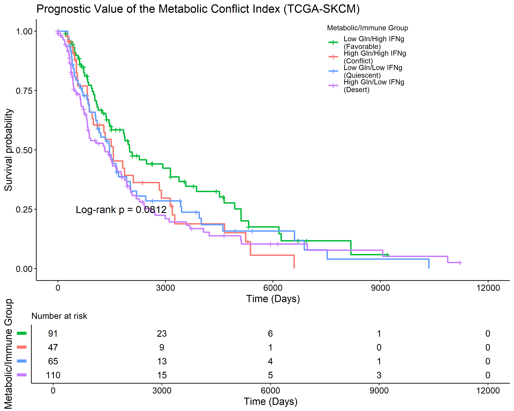
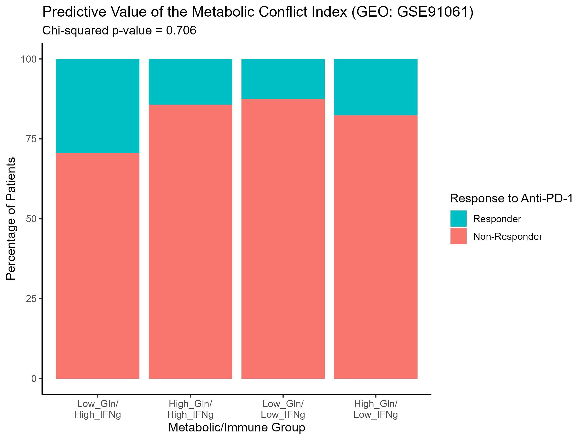

# Portfolio Project: Biomarker Analysis in Melanoma

### [View the Full Study on bioRxiv](https://www.biorxiv.org/content/10.1101/2025.09.28.679008v1)

---

## 1. Project Goal

This project was a complete, hypothesis-driven analysis to determine if a "metabolic conflict" signature, based on glutamine and IFNγ gene expression, could serve as a clinical biomarker in melanoma. The analysis was conducted in R using data from TCGA and GEO.

## 2. The Final Conclusion

The signature failed to provide independent prognostic or predictive value. While a promising trend was observed in the discovery cohort, the biomarker was not statistically significant after adjusting for clinical variables and failed validation in an independent immunotherapy cohort.

This repository showcases the key outputs and the R code used to generate them.

---

## 3. Key Outputs

### Figure 1: Prognostic Value in TCGA Cohort (n=313)

The "Favorable" group (Low Gln/High IFNg) showed a non-significant trend towards improved survival.
*(log-rank p = 0.081)*

### Figure 2: Predictive Value in GEO Cohort (n=49)

The signature showed no ability to predict response to anti-PD-1 immunotherapy.
*(Chi-squared p = 0.706)*

### Table 1: Final Multivariable Survival Model (TCGA)

After adjusting for clinical factors like age and tumor stage, neither the glutamine score, the IFNγ score, nor their interaction were significant independent predictors of survival.

| Predictor                  | Hazard Ratio (HR) | P-value |
| -------------------------- | ----------------- | ------- |
| Glutamine Score            | 0.052             | 0.239   |
| IFNγ Response Score        | 0.229             | 0.465   |
| **Age (per year)**         | **1.030**         | **0.019**   |
| Gender (Male vs. Female)   | 0.887             | 0.707   |
| Tumor Stage (Late vs. Early) | 1.038             | 0.904   |
| Interaction Term           | 0.131             | 0.606   |

*A simplified summary of the final Cox proportional hazards model. Full results are in the `final_outputs` folder.*

---

## 4. About This Repository

-   `/R_scripts`: Contains the R code for the final analysis and plotting pipeline. The code demonstrates skills in data wrangling, GSVA, survival analysis, and advanced `ggplot2` visualization.
-   `/final_outputs`: Contains a collection of the key figures and summary tables generated by the analysis.

*This repository is for portfolio and demonstration purposes. It showcases the final analysis code and results. The data acquisition scripts and input data files are available upon request.*
